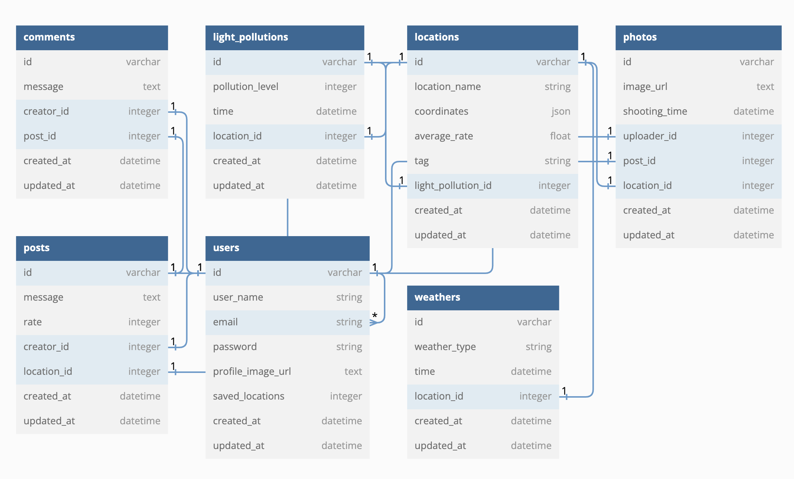
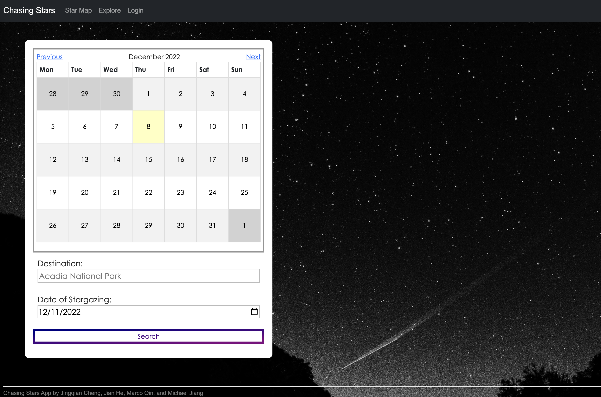
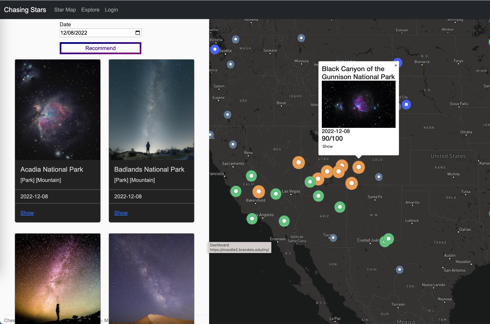
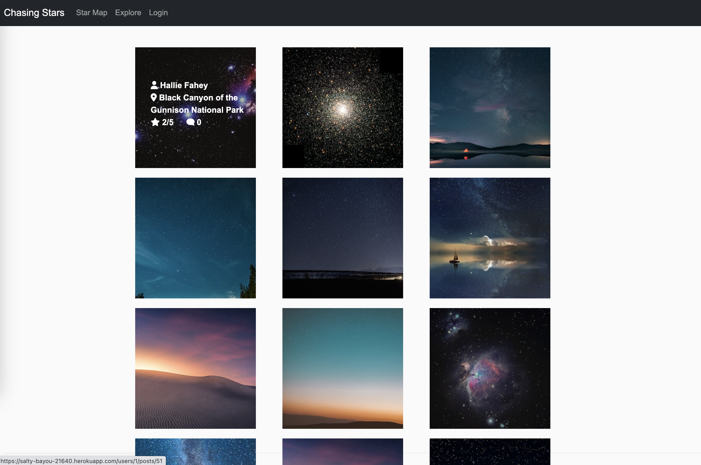
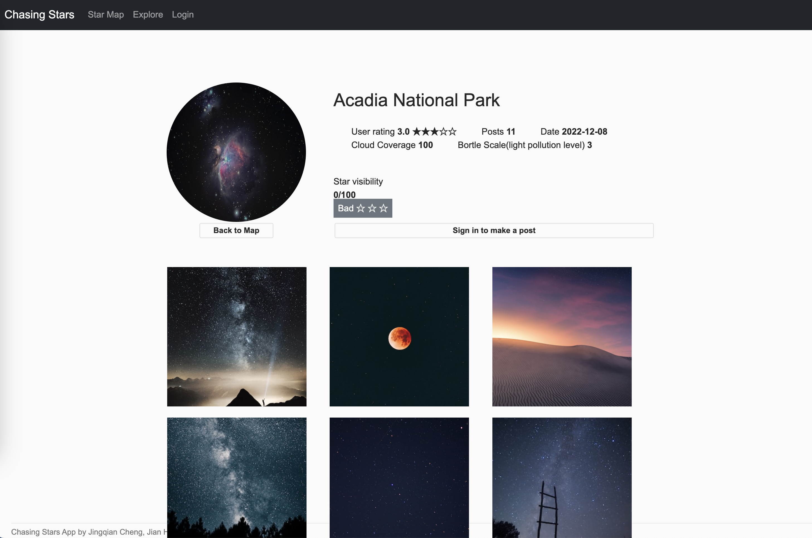
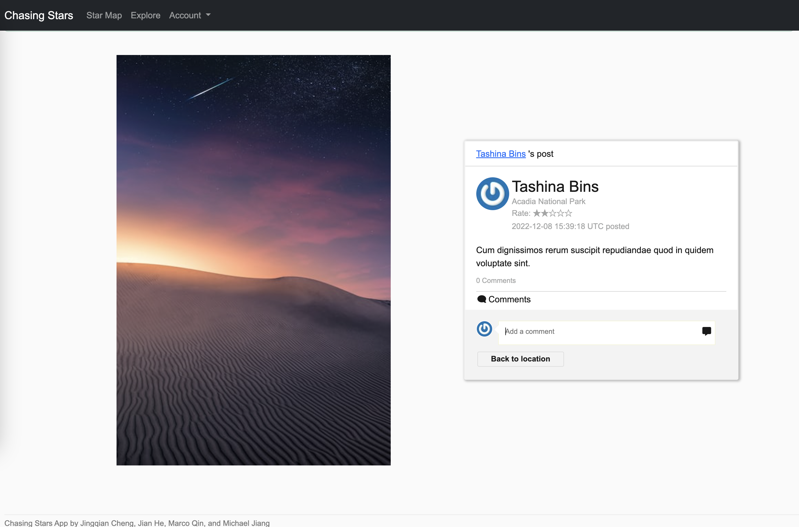
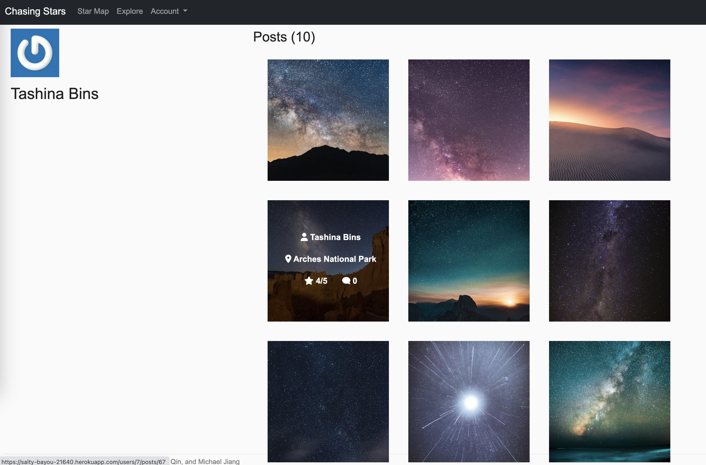
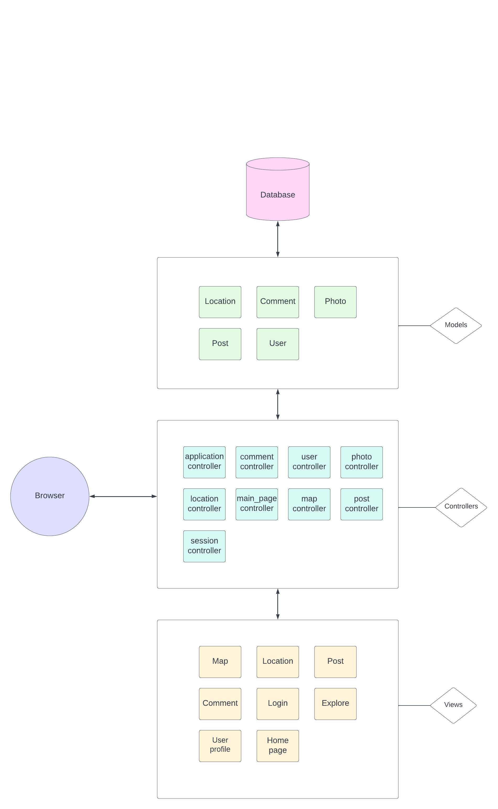

# Chasing Stars

## Introduction

Have you ever gazed at stars at night? Have you ever been fascinated with the mysterious starry sky?With Chasing Star, no matter whether you are an experienced Astro photographer or you just wants to watch stars in the night sky, you can check out the best spots near you, what’s better? You can even
share the joy and excitement of stargazing and taking Astro photos with others who use this app!


*“Look at the stars! look, look up at the skies!*

*O look at all the fire-folk sitting in the air!*

*The bright boroughs, the circle-citadels there!*

*The bright boroughs, the circle-citadels there!*

*Down in dim woods the diamond delves! the elves’-eyes!”*


## Summary

Chasing Stars app helps users find best stargazing spots. By entering desired date, the app will search and recommend best locations for stargazing based on weather/light pollution and other parameters. The app also allows users post their stargazing experiences and explore random posts to get inspirations.

## Purpose

The purpose of Chasing Stars is to build a tool and a community for those who love stargazing/astronomer or anyone who wants to find a good spot for watching night sky.

### Target users

- Stargazer
- Astronomer
- Anyone who wants to find good spots for watching night sky

## Prototype

Click [me](https://www.figma.com/proto/KOc5UqZg2ftcQqWEvJlc2Z/Chasing-Stars?node-id=203%3A1393&scaling=min-zoom&page-id=203%3A1392&starting-point-node-id=203%3A1393).

## Features

- **Interactive calendar** Enable users to browse and select date.
```
gem "simple_calendar", "~> 2.4"

```

- **Location search** Search locations based on location name and selected date.
```
def do_search
    @locations = Location.where("location_name ILIKE ?", "%#{params[:location_name]}%")
    @date = params[:date] == nil ? Date.today : Date.parse(params[:date])
    @date_diff = (@date - Date.today).to_i >= 0 ? (@date - Date.today).to_i : 0
    @show_date = @date_diff > 0 ? Date.today + @date_diff : Date.today 
    render :index
  end
```
- **Dynamic map** Display locations with different markers based on each one's star visibility score, click the marker will popup location's info.

- **Star visibility calculation** Calculate a location's star visibility by applying light pollution API, weather API, and Geo API through a carefully researched and tested algorithm
```
    def starVisibility(cloudCover, bortleScale)
        if cloudCover == "No Data"
          return "No Data"
        elsif cloudCover > 50 or bortleScale > 6
          return 0
        else  
          (100-cloudCover)-(bortleScale-1)*10
        end
    end
```
- **Stargazing Recommendation** Choose a date and recommend the best stargazing locations of that day
- **Explore** Display hot posts
- **Stargazing Community** Allow users make posts with pictures to rate locations, and make comments to other users' posts.
- **Authentication System** Allow users to login and manage their contents, have admin users to manage the community and maintain locations.

## Schema

The main tables of the app are location/user/post.

Location table has fields like weather/light pollution level, and those information are important for stargazing.

User can send a post to a location, and other users can see this post by visiting this location.

Click [me](https://dbdiagram.io/d/63404b3ff0018a1c5fba3e02) to see the app's schema on [dbdiagram](https://dbdiagram.io/d/63404b3ff0018a1c5fba3e02).



## A quick view of the app

**Home Page**


---

**Star Map**


---

**Explore**


---

**Location Page**


---

**Post Page**


---

**User's Posts**


---

## Technologies

### Light pollution algorithm

```
def getLightPollution(location)
        @location = location 
        api_key2 = ENV['LIGHT_POLLUTION_API_KEY']
        log = @location.longitude #longitude
        lat = @location.latitude #latitude
  
        def cleanLPdata(light_pollution)
          #remove the number after the comma
          return light_pollution.first(10).to_f
        end
    
        light_pollution = HTTParty.get("https://www.lightpollutionmap.info/QueryRaster/?ql=wa_2015&qt=point&qd=#{log},#{lat}&key=#{api_key2}")
        artificial_brightness = cleanLPdata(light_pollution)
        sqm = Math.log10((artificial_brightness+0.171168465)/108000000)/(-0.4)
    
        def bortleScale(sqm)
          light_pollution = sqm.to_f
          if light_pollution > 21.99
            return 1
          elsif light_pollution > 21.89
            return 2
          elsif light_pollution > 21.69
            return 3
          elsif light_pollution > 20.49
            return 4
          elsif light_pollution > 19.5
            return 5
          elsif light_pollution > 18.94
            return 6
          elsif light_pollution > 18.38
            return 7
          else
            return 8
          end
        end
  
        bortleScale(sqm)
    end
```
The algorithm is using cloud coverage and the light pollution to determine the ability to see stars in a given location. The weather API provides the level of cloud coverage from 0 to 100. 0 means no cloud is present in the sky, 100 means cloud overcast. The algorithm also converts the light pollution into the Bortle score using a function published by an American astronomer John E. Bortle.  In the end, the algorithm weights the cloud coverage and the Bortle score of that location and calculates the score on how well users can see stars at a given moment.

### List of dependencies on APIs, gems and libraries

**API**
* Mapbox API
* Light Pollution API
* Weather API
* Location API (National Parks)
* Upslash API (seed images)

**Gems**
* Faker: This gem is a port of Perl's Data::Faker library that generates fake data.
* Bootstrap: The most popular HTML, CSS, and JavaScript framework for developing responsive, mobile first projects on the web.
* Will_paginate: will_paginate is a pagination library that integrates with Ruby on Rails, Sinatra, Hanami::View, Merb, DataMapper and Sequel.
* Simple_calendar: A calendar for your Ruby on Rails app.
* Httparty: Fetch API data
* Dotenv-rails: Create environment variables
* Unsplash: Fetch Upslash API images

**Libraries**
* Boostrap
* Bcrypt
* Openssl
* URI
* Net/http
* MapBox

## Engineering challenges

One of the challenges we've met is query speed. When users try to search for locations, the query process will take about 30 seconds to finish, the main reason causing this is because of the speed limitation of light pollution API, the way we handle this problem is doing the query on seed file, and save it. By doing so, users won't feel lagging.

## Deployment

The app is deployed on [Heroku](https://salty-bayou-21640.herokuapp.com/).

## Instruction on running tests
```
rails test
```

## Architecture of the application

[**Link to architecture diagram**](https://lucid.app/lucidchart/6214e970-656c-42aa-95b4-594324bcabd2/edit?viewport_loc=-2497%2C-88%2C4311%2C4084%2C0_0&invitationId=inv_9724ac0e-4536-4011-80ba-9fc82873633f)




## Team members

- Jingqian Cheng: Backend  jingqiancheng@brandeis.edu
- Jian He: Frontend, UI/UX Design  jianhe@brandeis.edu
- Marco Qin: API/Algorithm  tqin@brandeis.edu
- Michael Jiang: Frontend  michaeljiang@brandeis.edu

## Next steps/reflections

- For next steps, we are going to work on user profile page and add more useful tools for stargazing.

- Since the query of the app is relatively slow, we plan to add a rule to let the database update daily, this can reduce the processing time.

- We also plan to use Redis to save the results of API access by users, so that we can save some time for other users.

By developing this project, we've learned a lot about software development and Ruby on Rails framework. There's a lot of things to consider in software development such as testing, scaling, etc.

We are going to continue working on this project and hope it can serve more people in the future.